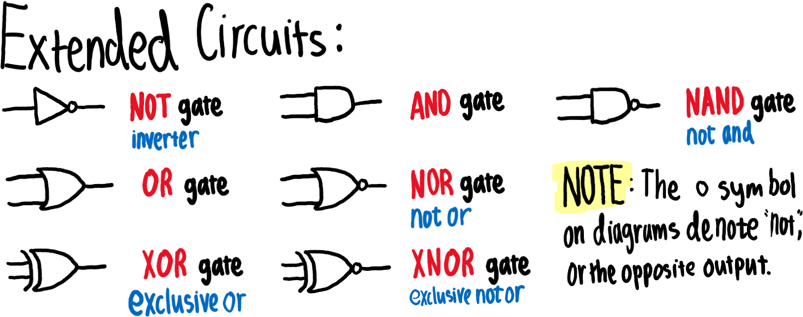

## Circuits (Discrete Mathematics, Logic Gate Symbols Extended)  
CS-113 Discrete Structures  

**Reference: [Circuit Symbols](https://electronicsclub.info/circuitsymbols.htm) from [Electronics Club](https://electronicsclub.info/)**  

Logic gates process signals which represent true (1, high, +Vs, on) or false (0, low, 0V, off). For more information please see the page on [logic gates](https://electronicsclub.info/gates.htm). There are two sets of symbols: traditional and IEC (International Electrotechnical Commission).  

  

- [**NOT**](https://electronicsclub.info/gates.htm#not)
  - A NOT gate can only have one input. The 'o' on the output means 'not'. The output of a NOT gate is the inverse (opposite) of its input, so the output is true when the input is false. A NOT gate is also called an inverter.
- [**AND**](https://electronicsclub.info/gates.htm#and)
  - An AND gate can have two or more inputs. The output of an AND gate is true when all its inputs are true.
- [**NAND**](https://electronicsclub.info/gates.htm#nand)
  - A NAND gate can have two or more inputs. The 'o' on the output means 'not' showing that it is a **N**ot **AND** gate. The output of a NAND gate is true unless all its inputs are true.
- [**OR**](https://electronicsclub.info/gates.htm#or)
  - An OR gate can have two or more inputs. The output of an OR gate is true when at least one of its inputs is true.
- [**NOR**](https://electronicsclub.info/gates.htm#nor)
  - A NOR gate can have two or more inputs. The 'o' on the output means 'not' showing that it is a **N**ot **OR** gate. The output of a NOR gate is true when none of its inputs are true.
- [**EX-OR**](https://electronicsclub.info/gates.htm#exor)
  - An EX-OR gate can only have two inputs. The output of an EX-OR gate is true when its inputs are different (one true, one false).
- [**EX-NOR**](https://electronicsclub.info/gates.htm#exnor)
  - An EX-NOR gate can only have two inputs. The 'o' on the output means 'not' showing that it is a **N**ot **EX-OR** gate. The output of an EX-NOR gate is true when its inputs are the same (both true or both false).
